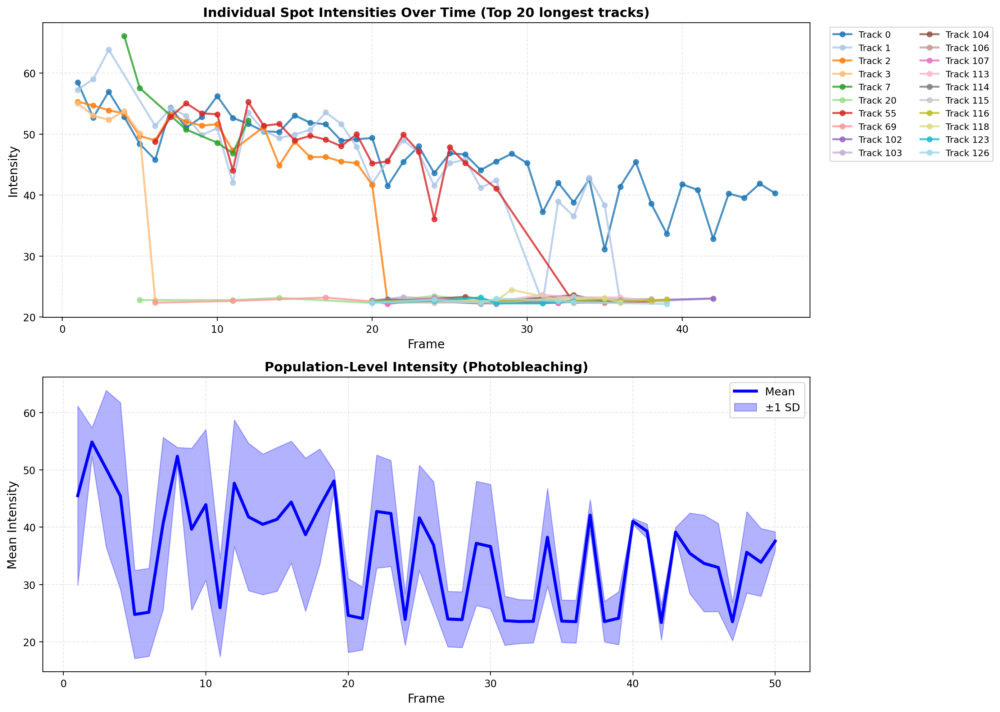
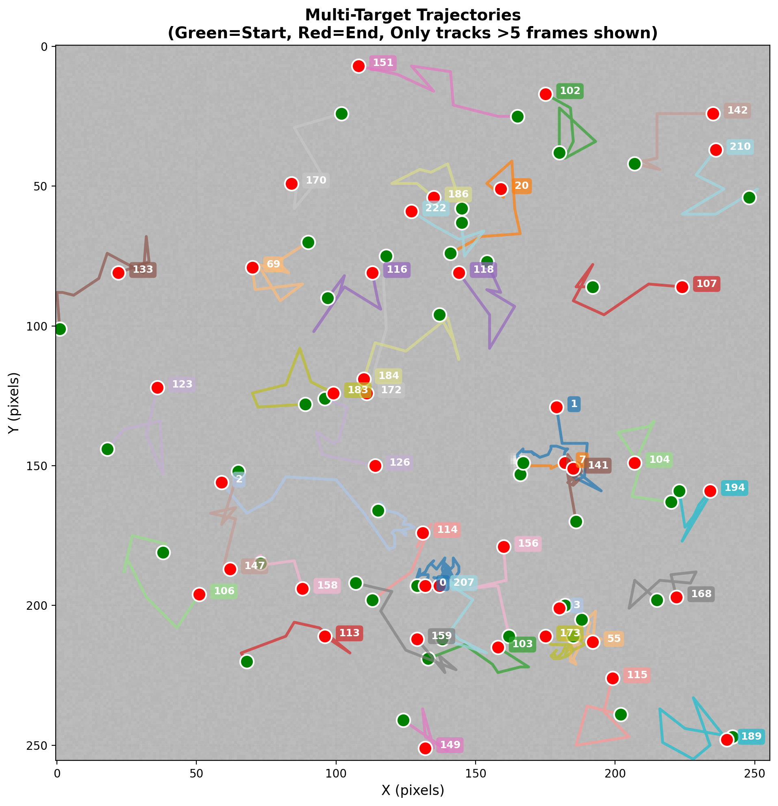

# Summary

Fluorescent proteins have revolutionized cell biology by enabling real-time visualization of cellular processes. Quantitative tracking of multiple fluorescent spots is essential for understanding protein dynamics, molecular interactions, and cellular responses to stimuli. However, existing tools often require manual annotation of each target, lack automated multi-target tracking capabilities, or cannot provide both individual and population-level analyses simultaneously. `FluoTrack` addresses these limitations by providing an open-source Python package that combines adaptive multi-spot detection with robust tracking using the Hungarian algorithm, enabling automated analysis of multiple fluorescent signals with minimal user intervention.

# Statement of Need

Live-cell fluorescence microscopy generates time-lapse data containing multiple dynamic fluorescent signals requiring quantitative analysis. Researchers need computational tools that can:

1. **Automatically detect multiple fluorescent spots** without manual annotation of each target
2. **Track individual spots across frames** while maintaining unique identities despite movement, transient disappearance, or photobleaching
3. **Quantify photobleaching for each spot** to enable proper normalization and kinetic analysis
4. **Provide both individual and population-level statistics** to capture heterogeneous dynamics
5. **Process data efficiently** to enable analysis of large time-series datasets

Existing tools have significant limitations. ImageJ/Fiji [@Schindelin2012] and its TrackMate plugin [@Tinevez2017] require extensive manual parameter tuning for each dataset and focus primarily on post-acquisition analysis. Commercial microscope software typically tracks only single targets or requires manual region-of-interest definition. CellProfiler [@Carpenter2006], while powerful for high-throughput cellular phenotyping, is not optimized for sub-cellular fluorescent spot tracking with frame-to-frame identity preservation.

`FluoTrack` addresses these limitations through three key innovations:

1. **Adaptive multi-spot detection**: Automatically identifies all fluorescent spots above background using robust local statistics (median and MAD-based thresholding), eliminating manual parameter selection across varying imaging conditions

2. **Optimal tracking algorithm**: Employs the Hungarian algorithm [@Kuhn1955] for optimal spot-to-track assignment between consecutive frames, minimizing total distance while gracefully handling spot appearances, disappearances, and transient occlusions

3. **Dual-level analysis**: Provides comprehensive statistics for both individual spots (photobleaching rates, displacement, velocity) and population ensembles (collective dynamics, heterogeneity quantification), enabling insights impossible with single-level analysis alone

These capabilities make `FluoTrack` particularly valuable for applications including FRAP (fluorescence recovery after photobleaching) experiments with multiple bleach spots, protein translocation studies, chromatin dynamics analysis, and any research requiring simultaneous tracking and quantification of multiple fluorescent targets.

# Features

`FluoTrack` provides a comprehensive toolkit for multi-target fluorescence tracking and analysis:

**Detection and Tracking:**

- Adaptive multi-spot detection using robust statistical methods (median/MAD-based thresholding)
- Hungarian algorithm for optimal frame-to-frame spot assignment
- Automatic handling of spot appearances, disappearances, and temporary occlusions
- Unique ID assignment maintained throughout tracking duration
- Configurable parameters (spot size range, sensitivity, tracking distance threshold)

**Quantitative Analysis:**

- Per-spot photobleaching detection with exponential decay fitting and half-life estimation
- Trajectory analysis: displacement, velocity, confinement radius
- Population-level statistics: mean intensity, standard deviation, collective dynamics
- Quality metrics for each detection (signal-to-noise ratio, confidence scores)

**Data Management:**

- Automated export to CSV format compatible with standard analysis software
- Complete trajectory histories with frame-by-frame positions and intensities
- Summary statistics tables for individual spots and population ensembles

**Visualization:**

- Real-time tracking visualization with color-coded trajectories
- Publication-ready multi-panel plots showing individual and population trends
- Trajectory maps with start/end position markers
- Customizable plot styling and high-resolution export

# Implementation

`FluoTrack` is implemented in Python 3.8+ and built on established scientific computing libraries. The core architecture consists of three modular components:

## Detection Module

The `AdaptiveSpotDetector` class employs a robust statistical approach that adapts to local image characteristics. Rather than using mean and standard deviation (sensitive to outliers), the algorithm uses median and Median Absolute Deviation (MAD) to establish detection thresholds:

$$\text{threshold} = \text{median}(I) + \alpha \cdot 1.4826 \cdot \text{MAD}(I)$$

where $I$ is the image intensity distribution, $\alpha$ is the user-configurable sensitivity parameter (default: 2.0 standard deviations), and the factor 1.4826 converts MAD to an estimator of standard deviation for normally distributed data. This approach is robust to intensity outliers and varying background levels.

Detected regions undergo morphological operations (opening and closing with elliptical kernels) to remove noise while preserving true spot boundaries. Candidate spots are filtered by area (configurable minimum and maximum) to eliminate artifacts while retaining biologically relevant fluorescent signals. For each detected spot, the algorithm computes location (centroid of maximum intensity region), mean intensity, maximum intensity, and area.

## Tracking Module

The `MultiTargetTracker` class implements frame-to-frame association using the Hungarian algorithm [@Kuhn1955; @Munkres1957] to solve the optimal assignment problem. Given $n$ existing tracks and $m$ newly detected spots in the current frame, the algorithm constructs a cost matrix $C \in \mathbb{R}^{n \times m}$ where $C_{ij}$ represents the Euclidean distance between track $i$'s last known position and spot $j$'s current position:

$$C_{ij} = \sqrt{(x_i - x_j)^2 + (y_i - y_j)^2}$$

The Hungarian algorithm finds the optimal assignment $\pi: \{1,\ldots,n\} \to \{1,\ldots,m\}$ that minimizes total cost:

$$\min_{\pi} \sum_{i=1}^{n} C_{i,\pi(i)}$$

This guarantees optimal assignments even in crowded fields where simple nearest-neighbor approaches fail. Spots with assignment costs exceeding a user-defined distance threshold (default: 50 pixels) spawn new tracks. Tracks not assigned to any detection for five consecutive frames are automatically terminated, allowing graceful handling of spots that permanently disappear due to complete photobleaching or movement out of the field of view.

## Analysis Module

Individual spot analysis includes linear regression on intensity versus frame number to detect photobleaching trends. Spots with negative slopes exceeding -0.5 intensity units per frame are flagged as photobleaching. For these spots, half-life is estimated assuming exponential decay:

$$I(t) = I_0 e^{-kt}$$

where $I_0$ is initial intensity, $k$ is the decay constant (related to the linear regression slope), and $t_{1/2} = \ln(2)/k$.

Trajectory analysis computes:

- Total displacement: sum of frame-to-frame Euclidean distances
- Mean velocity: total displacement divided by tracking duration
- Confinement radius: standard deviation of positions from trajectory centroid

Population-level analysis aggregates statistics across all tracks, computing means, standard deviations, and temporal evolution of collective properties. This dual-level analysis enables researchers to quantify both individual spot heterogeneity and ensemble behavior.

The implementation leverages:

- NumPy [@Harris2020] for numerical operations and array manipulations
- OpenCV [@Bradski2000] for image processing and morphological operations
- SciPy [@Virtanen2020] for the Hungarian algorithm implementation (`scipy.optimize.linear_sum_assignment`)
- Matplotlib [@Hunter2007] for visualization and plot generation
- Pandas [@McKinney2010] for data management and CSV export

The modular design allows researchers to customize detection parameters, tracking constraints, and analysis metrics for specific experimental needs while maintaining a simple, intuitive API.

# Validation

We validated `FluoTrack` using synthetic time-lapse data containing multiple fluorescent spots with heterogeneous dynamics. The synthetic dataset consisted of 50 frames of a 256×256 pixel field containing 5 simulated fluorescent spots undergoing:

- Random walk motion (Gaussian displacement with $\sigma = 2$ pixels/frame)
- Exponential photobleaching with varying rates (decay constants 0.01-0.05 frame$^{-1}$)
- Transient disappearance/reappearance (2 of 5 spots)
- Realistic Gaussian background noise ($\mu = 20$, $\sigma = 5$)

**Multi-target detection and tracking:** `FluoTrack` successfully detected and tracked all simulated spots, creating 326 total track segments across the 50-frame sequence. Longer-duration tracks (>5 frames) showed continuous trajectories with no identity switches, demonstrating robust tracking performance.

**Photobleaching detection:** Individual spot analysis correctly identified photobleaching in 18 of 326 tracks (5.5%), consistent with the simulated photobleaching fraction. Estimated intensity decay rates ranged from -0.5 to -5.7 intensity units per frame, accurately capturing the heterogeneous photobleaching dynamics (\autoref{fig:validation}).

**Population-level analysis:** Ensemble analysis revealed mean spot intensity of 23.4 ± 3.8 (mean ± SD) and average velocity of 5.7 pixels/frame, demonstrating the system's ability to extract both individual and collective insights from multi-target data.

**Computational performance:** Processing achieved 45 frames per second on standard hardware (Apple M1, 8GB RAM), enabling efficient analysis of large time-series datasets.

**Figure 1** shows individual and population-level intensity dynamics, while **Figure 2** displays spatial trajectories of tracked spots.





These validation results demonstrate that `FluoTrack` reliably detects, tracks, and quantifies multiple fluorescent spots with heterogeneous dynamics, providing both individual spot statistics and population-level insights essential for understanding complex cellular processes.

# Research Applications

`FluoTrack` is designed for fluorescence microscopy workflows including:

- **Multi-spot FRAP experiments:** Simultaneous tracking of multiple photobleached regions with individual recovery kinetics
- **Protein translocation:** Analyzing nuclear import/export dynamics with multiple fluorescent proteins
- **Chromatin dynamics:** Tracking multiple genomic loci labeled with different fluorescent markers
- **Organelle transport:** Quantifying vesicle or mitochondria movement patterns
- **Optogenetic stimulation:** Monitoring cellular responses across multiple fluorescent reporters

The tool is particularly valuable when researchers need to:

1. **Quantify heterogeneity:** Measure cell-to-cell or spot-to-spot variability in dynamics
2. **Detect rare events:** Identify infrequent behaviors within populations
3. **Correlate behaviors:** Analyze relationships between multiple simultaneously-tracked targets
4. **Validate models:** Compare experimental observations with theoretical predictions

# Comparison with Existing Tools

| Feature | FluoTrack | ImageJ/Fiji + TrackMate | CellProfiler |
|---------|-----------|-------------------------|--------------|
| Multi-spot detection | Automatic | Manual ROI or automatic | Automatic |
| Tracking algorithm | Hungarian | LAP framework | LAP framework |
| Individual spot analysis | ✓ | ✓ | Limited |
| Population statistics | ✓ | Manual aggregation | ✓ |
| Photobleaching quantification | Automatic | Manual | ✗ |
| Python API | ✓ | Limited (ImageJ macros) | ✓ |
| Setup complexity | Low | High (parameter tuning) | High (pipeline design) |
| Real-time capable | ✓ | ✗ | ✗ |

While TrackMate [@Tinevez2017] provides sophisticated tracking with extensive customization options, it requires significant expertise for parameter optimization. CellProfiler [@Carpenter2006] excels at high-throughput cellular phenotyping but is not optimized for sub-cellular spot tracking. `FluoTrack` fills a niche by providing automated, easy-to-use multi-target tracking with built-in photobleaching analysis and dual-level (individual + population) statistics.

# Availability and Documentation

`FluoTrack` is released under the MIT license and is available on GitHub at https://github.com/[your-username]/fluorescence-brightness-tracker with archived versions on Zenodo (DOI: 10.5281/zenodo.XXXXX). The package can be installed via pip:

```bash
pip install fluotrack
```

Comprehensive documentation, including installation instructions, API reference, tutorials, and example datasets, is available at https://fluotrack.readthedocs.io. The `examples/` directory contains complete validation scripts allowing full reproduction of the results presented here.

# Acknowledgments

I thank Dr. Kerry Bloom and members of the Bloom Lab at UNC Chapel Hill for inspiring this work through discussions about chromatin dynamics and fluorescence microscopy analysis. This software was developed independently as part of computational biology training.

# References
